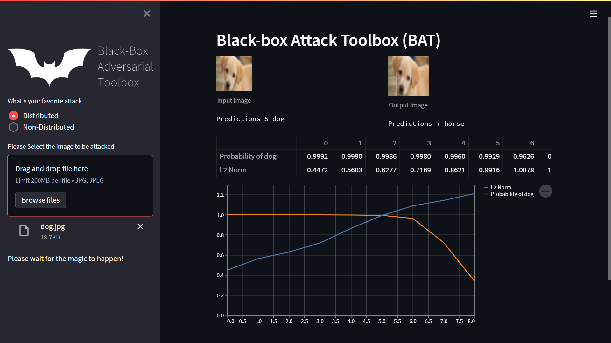

# BAT App

> Demo application for the Black-box Adversarial Toolbox (BAT)

This app demonstrates how to attack the image classification cloud api in several seconds

https://github.com/wuhanstudio/blackbox-adversarial-toolbox

The cifar10 raw image dataset is available here:

- https://github.com/YoongiKim/CIFAR-10-images
